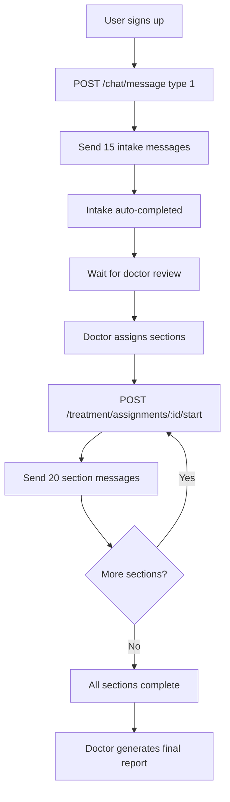
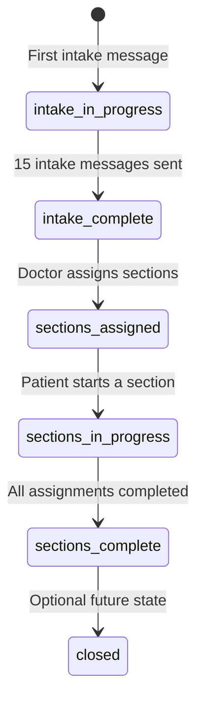
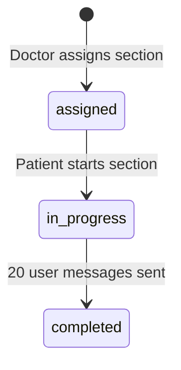

# Zehnify Treatment Flow

This document describes the structured mental health treatment workflow, chat types, state machines, and frontend integration guide.

## Overview

Zehnify guides patients through a structured treatment cycle:

1. **Intake Assessment** — 15 user messages with an AI wellness assistant
2. **Doctor Review** — Doctor generates an initial clinical report
3. **Section Assignment** — Doctor assigns 1-5 therapeutic sections (20 messages each)
4. **Section Completion** — Patient completes assigned sections in order
5. **Final Report** — Doctor generates a comprehensive treatment report

## Patient Journey



## Chat Types

| Type | Enum Value | Name | Limit | Who Starts |
|------|-----------|------|-------|------------|
| 1 | `INTAKE_ASSESSMENT` | Intake Assessment | 15 user messages | Patient (first message) |
| 2 | `MOOD_EMOTIONAL_AWARENESS` | Mood & Emotional Awareness | 20 user messages | Doctor assigns, patient starts |
| 3 | `COGNITIVE_RESTRUCTURING` | Cognitive Restructuring | 20 user messages | Doctor assigns, patient starts |
| 4 | `BEHAVIORAL_ACTIVATION` | Behavioral Activation | 20 user messages | Doctor assigns, patient starts |
| 5 | `COPING_STRESS_MANAGEMENT` | Coping & Stress Management | 20 user messages | Doctor assigns, patient starts |
| 6 | `RELAPSE_PREVENTION_GOALS` | Relapse Prevention & Goals | 20 user messages | Doctor assigns, patient starts |

### Psychology Rationale

Based on CBT (Cognitive Behavioral Therapy) session structure:

- **Type 1 — Intake:** Initial assessment, mood check, symptom exploration (like CBT intake/first session)
- **Type 2 — Mood & Emotional Awareness:** Emotional identification, triggers, body-mind connection (session opening phase)
- **Type 3 — Cognitive Restructuring:** Automatic thoughts, cognitive distortions, reframing (core CBT technique)
- **Type 4 — Behavioral Activation:** Activity-mood linkage, avoidance patterns, behavioral experiments
- **Type 5 — Coping & Stress Management:** Grounding, breathing, problem-solving toolkit
- **Type 6 — Relapse Prevention & Goals:** Homework review, maintenance plan, warning signs (closing phase)

## State Machines

### TreatmentPlan Status



| Status | Meaning |
|--------|---------|
| `intake_in_progress` | Patient is in intake chat |
| `intake_complete` | 15 intake messages done, awaiting doctor |
| `sections_assigned` | Doctor assigned sections, patient hasn't started |
| `sections_in_progress` | Patient working on sections |
| `sections_complete` | All assigned sections finished |
| `closed` | Treatment cycle closed (future use) |

### SectionAssignment Status



Sections unlock **sequentially** by `sortOrder`. Patient must complete section with `sortOrder: 1` before starting `sortOrder: 2`, etc.

## Frontend Integration Guide

### Step 1: Patient Dashboard — Check Status

```
GET /treatment/status
Authorization: Bearer <token>
```

Use response to show:
- Intake progress bar (`intakeProgress.userMessages / intakeProgress.required`)
- Assigned sections list with status badges
- Whether patient can start next section

### Step 2: Patient Sends Intake Messages

```
POST /chat/message
{
  "type": 1,
  "content": "I've been feeling anxious lately."
}
```

- Omit `chatId` on first message (creates plan + intake chat)
- Include `chatId` on subsequent messages
- Response includes `messagesRemaining`, `userMessageCount`, `messageLimit`

### Step 3: Doctor Views Patients

```
GET /doctor/patients
Authorization: Bearer <doctor_token>
```

Show patients where `reportGeneratable: true` (15 intake messages complete).

### Step 4: Doctor Generates Initial Report

```
POST /report/generate
{ "userId": "<patient-uuid>" }
```

Required before assigning sections. Response includes `report` (markdown) and `reportId`.

### Step 5: Doctor Assigns Sections

```
POST /doctor/patients/:userId/assign-sections
{
  "sections": [
    { "sectionType": 2, "sortOrder": 1, "doctorNotes": "Focus on anxiety triggers" },
    { "sectionType": 3, "sortOrder": 2 },
    { "sectionType": 5, "sortOrder": 3 }
  ]
}
```

- Pick 1-5 section types from types 2-6
- No duplicate section types
- `sortOrder` defines unlock sequence

### Step 6: Patient Starts Section

```
POST /treatment/assignments/:assignmentId/start
```

Returns chat object. Use `chatId` for subsequent messages.

### Step 7: Patient Sends Section Messages

```
POST /chat/message
{
  "chatId": "<section-chat-uuid>",
  "type": 2,
  "content": "..."
}
```

### Step 8: Doctor Generates Final Report

After `finalReportGeneratable: true`:

```
POST /report/generate-final
{ "userId": "<patient-uuid>" }
```

Download PDF:
```
GET /report/download-final?userId=<patient-uuid>
```

## Mood Scanning During Chat

While a patient has an active chat session (intake or assigned section), the frontend captures webcam frames every **3 seconds** and sends them to `POST /mood/analyze`. The backend proxies images to the Hugging Face FER API and stores predictions in `emotion_snapshots`.

- **Cap:** 50 accepted snapshots per `chatId` (rejected frames such as "no face detected" do not count)
- **Scope:** Each intake chat and each section chat has its own 50-scan budget
- **Doctor view:** `GET /mood/patient/:userId/summary` returns per-chat dominant emotion and scan counts

Mood capture runs only when the camera is on, a `chatId` exists, and the session is not complete or waiting for doctor assignment.

## Eligibility Flags

| Flag | Condition |
|------|-----------|
| `reportGeneratable` | 15 intake user messages complete |
| `hasInitialReport` | Doctor generated initial report |
| `finalReportGeneratable` | All assigned sections completed |
| `completionPercentage` | Section completion % (or intake % if no sections yet) |

## Database Tables

- `treatment_plans` — One active plan per patient
- `section_assignments` — Doctor-assigned therapeutic sections
- `clinical_reports` — Persisted initial and final reports
- `chat` — Extended with `treatmentPlanId`, `sectionAssignmentId`, `status`
- `message` — Unchanged
- `emotion_snapshots` — Facial emotion predictions per chat session (50 accepted cap per `chatId`)

## Error Cases

| Error | Cause |
|-------|-------|
| `Message limit reached` | 15 or 20 user messages exceeded |
| `Complete previous assigned sections` | Trying to start section out of order |
| `Initial intake report must be generated` | Doctor assigning before report |
| `Sections have already been assigned` | Duplicate assignment attempt |
| `All assigned sections must be completed` | Final report before completion |
